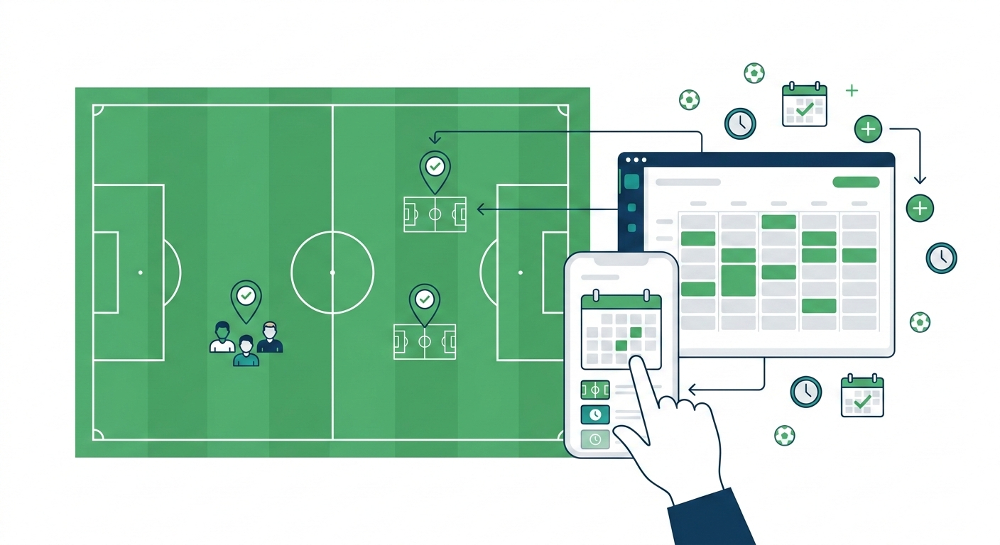
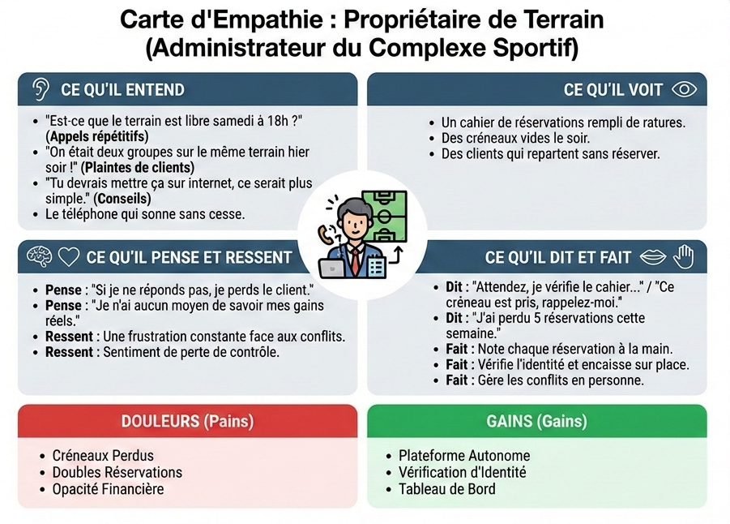
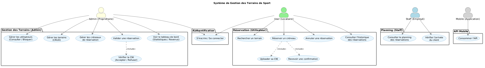
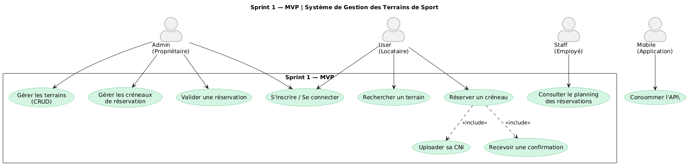
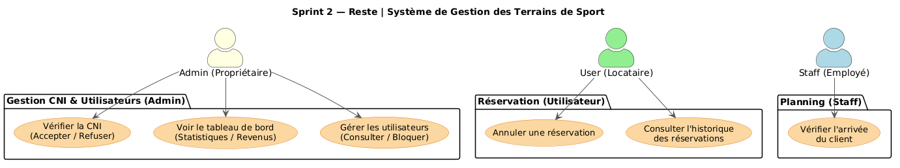
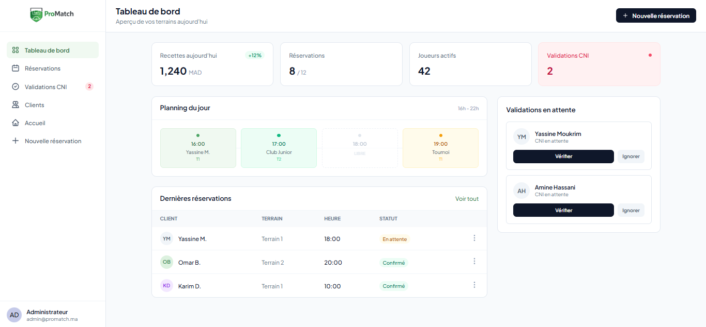
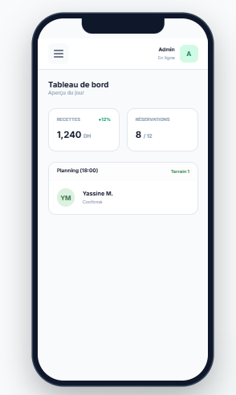
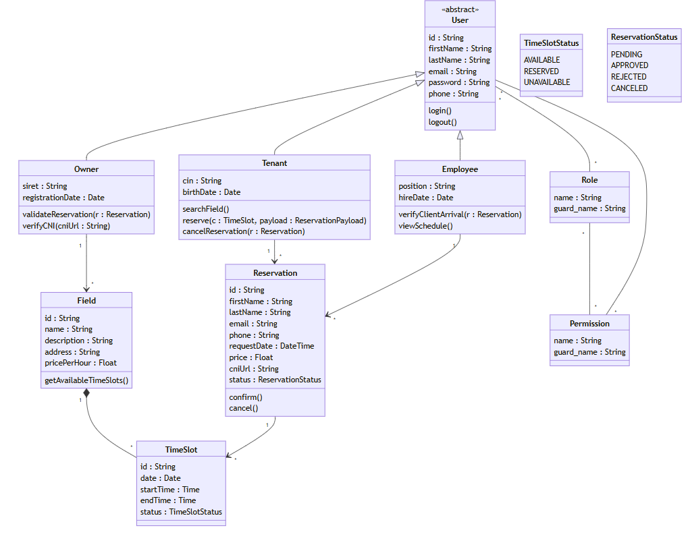

  
  

# **Projet de Fin de Formation**

### \*\* Système de Gestion des Terrains de Sport

**Réalisé par :** Adnane Kesksu
**Encadré par :** M. ESSARRAJ Fouad  
**Filière :** Développement Mobile et Web

---

## Sommaire

  

1

Contexte du projet

  

2

Méthodologie de travail

  

3

Branche Fonctionnelle

  

4

Branche Technique

  

5

Conception

  

6

Démonstration

  

7

Conclusion

---

## 1. Contexte du projet

  

---

## 2. Méthodologie : Design Thinking

  

---

## Méthodologie : Scrum (Agile)

  

---

### 1. DESIGN THINKING : Empathie

  

---

### 2. DESIGN THINKING : Définition

  

    <h3 style="color: #e74c3c; margin-bottom: 20px;">Le Constat (Frictions)</h3>
    <ul style="list-style-type: none; padding-left: 0;">
      <li style="margin-bottom: 15px;">❌ <strong>Gestion Archaïque :</strong> 100% manuelle, risques de doublons et erreurs.</li>
      <li style="margin-bottom: 15px;">❌ <strong>Communication Lente :</strong> Dépendance totale à l'intermédiaire téléphonique.</li>
      <li style="margin-bottom: 15px;">❌ <strong>Zéro Visibilité :</strong> Aucune vue en temps réel sur les disponibilités.</li>
      <li style="margin-bottom: 15px;">❌ <strong>Insécurité :</strong> Pas de preuve d'achat et risque élevé d'absentéisme.</li>
    </ul>
  

  

    <h3 style="color: #27ae60; margin-bottom: 20px;">Notre Solution</h3>
    <ul style="list-style-type: none; padding-left: 0;">
      <li style="margin-bottom: 15px;">✅ <strong>Digitalisation :</strong> Centralisation de l'offre et de la demande.</li>
      <li style="margin-bottom: 15px;">✅ <strong>Self-Service :</strong> Réservation instantanée sans intervention humaine.</li>
      <li style="margin-bottom: 15px;">✅ <strong>Fiabilité :</strong> Vérification de CNI et confirmations numériques.</li>
      <li style="margin-bottom: 15px;">✅ <strong>Suivi :</strong> Tableau de bord pour les revenus et l'historique.</li>
    </ul>
  

---

### 3. DESIGN THINKING : Idéation

  

    <h3 style="color: #f39c12; margin-bottom: 20px;">Stratégie Digitale</h3>
    <ul style="list-style-type: none; padding-left: 0;">
      <li style="margin-bottom: 15px;">💡 <strong>Disponibilité 24/7 :</strong> Plateforme en ligne pour éliminer les barrières temporelles.</li>
      <li style="margin-bottom: 15px;">💡 <strong>Validation CNI :</strong> Processus sécurisé avec approbation administrateur.</li>
      <li style="margin-bottom: 15px;">💡 <strong>Gestion Mobile :</strong> Interface optimisée pour les réservations sur le terrain.</li>
      <li style="margin-bottom: 15px;">💡 <strong>Analyse Métier :</strong> Dashboard pour optimiser l'occupation des terrains.</li>
    </ul>
  

  

     <h3 style="color: #088dc7; margin-bottom: 20px;">Expérience Utilisateur</h3>
    
Transformation d'un processus verbal et incertain en une expérience numérique fluide, sécurisée et valorisante pour le complexe sportif.

  

---

## Branche Fonctionnelle : Cas d'utilisation

### Global Use Case

  <h3>Interaction Utilisateur (UML)</h3>
  

---

## Branche Fonctionnelle : Cas d'utilisation

### Sprint 1 :

  

    
  

---

## Branche Fonctionnelle : Cas d'utilisation

### sprint 2:

 

  

    
  

---

## Branche Fonctionnelle : Maquettes (UI/UX)

  

    
  

---

## Branche Fonctionnelle : Maquettes (UI/UX) Mobile

  

    
  

---

## 4. Branche Technique : Tech Stack

  

    <h4>Les technologies à utiliser</h4>
    <ul>
      <li><strong>Base de données:</strong> MySQL</li>
      <li><strong>Framework:</strong> Laravel 12</li>
      <li><strong>Architecture N-Tiers:</strong>
        <ul style="margin-top: 5px;">
          <li>Controller: Requêtes HTTP</li>
          <li>Service: Logique métier</li>
          <li>Model: Base de données</li>
        </ul>
      </li>
      <li><strong>Architecture MVC</strong></li>
      <li><strong>Blade:</strong> Templates réutilisables</li>
    </ul>
  

  

    <ul>
      <li><strong>AJAX:</strong> Interactions dynamiques sans rechargement</li>
      <li><strong>Alpine.js:</strong> Librairie JavaScript dynamique</li>
      <li><strong>Spatie:</strong> Gestion permissions et rôles</li>
      <li><strong>Vite:</strong> Outil de build rapide</li>
      <li><strong>Lucide:</strong> Librairie d'icônes</li>
      <li><strong>Tailwind CSS:</strong> Développement responsive</li>
    </ul>
  

---

## 5. Conception : Diagramme de classe

<h3>Modélisation des données (MLD)</h3>

  

---

## 6. Démonstration : Environnement & Outils

  

    <h4>Environnement de Développement</h4>
    <ul>
      <li><strong>IDE:</strong> VS Code & Antigravity</li>
      <li><strong>Monitoring DB:</strong> Workbench SQL</li>
    </ul>
  

  

    <h4>Gestion & Déploiement</h4>
    <ul>
      <li><strong>Modélisation UML:</strong> Mermaid/PlantUML</li>
      <li><strong>Gestion de version:</strong> Git (GitHub)</li>
      <li><strong>Navigateur:</strong> Chrome DevTools</li>
    </ul>
  

---

## 7. Conclusion

### Merci pour votre attention !
