---

marp: true
theme: default
_class: lead
_paginate: false
paginate: true
backgroundColor: #f8fafc
style: |
  @import url('https://fonts.googleapis.com/css2?family=Plus+Jakarta+Sans:wght@400;600;700;800&display=swap');
  
  section {
    font-family: 'Plus Jakarta Sans', sans-serif;
    font-size: 24px;
    color: #0f172a;
    padding: 50px 70px;
    background: #f8fafc;
  }

  h1 { 
    color: #3d8a54;
    font-weight: 800;
    font-size: 2.8em;
    margin-bottom: 10px;
  }

  h2 { 
    color: #0f172a; 
    font-size: 1.8em; 
    border-bottom: 3px solid #4da565;
    padding-bottom: 10px;
    margin-bottom: 40px;
    font-weight: 700;
  }

  h3 { color: #64748b; font-weight: 600; margin-top: 0; }

  /* Cover Slide Customization */
  section.lead {
    background: linear-gradient(135deg, #f0f9f1 0%, #ffffff 100%);
    text-align: center;
    display: flex;
    flex-direction: column;
    justify-content: center;
    align-items: center;
  }
  
  section.lead h1 {
    background: linear-gradient(90deg, #3d8a54, #4da565);
    -webkit-background-clip: text;
    -webkit-text-fill-color: transparent;
    margin-bottom: 20px;
  }

  .logo-header {
    display: flex;
    justify-content: space-between;
    align-items: center;
    width: 85%;
    position: absolute;
    top: 40px;
  }
  .logo-header img { height: 120px; }

  /* Summary Grid */
  .sommaire-grid {
    display: grid;
    grid-template-columns: 1fr 1fr;
    gap: 20px;
    margin-top: 20px;
  }
  .sommaire-item {
    background: white;
    border: 1px solid #e2e8f0;
    border-left: 6px solid #4da565;
    padding: 18px 25px;
    border-radius: 16px;
    display: flex;
    align-items: center;
    box-shadow: 0 4px 12px rgba(0, 0, 0, 0.05);
    transition: transform 0.2s ease;
  }
  .sommaire-num {
    background: #4da565;
    color: white;
    width: 35px;
    height: 35px;
    border-radius: 50%;
    display: flex;
    justify-content: center;
    align-items: center;
    font-weight: 800;
    margin-right: 20px;
    flex-shrink: 0;
  }
  .sommaire-text { font-weight: 600; color: #1e293b; }

  .img-container {
    display: flex;
    justify-content: center;
    align-items: center;
    height: 70%;
  }
  .img-methodo {
    max-width: 90%;
    max-height: 400px;
    border-radius: 12px;
    box-shadow: 0 20px 25px -5px rgba(0, 0, 0, 0.1);
  }

  .dt-card {
    background: white;
    padding: 25px;
    border-radius: 16px;
    border-top: 6px solid #4da565;
    box-shadow: 0 10px 15px -3px rgba(0, 0, 0, 0.1);
  }

---

<!-- _class: lead -->

  
  

# Projet de Fin de Formation
### Système Intelligent de Gestion de Terrains <h3 style="color: #4da565;">- ProMatch</h3>

**Réalisé par :** Adnane Kesksu  
**Encadré par :** M. ESSARRAJ Fouad  
**Filière :** Développement Mobile et Web  

**Date :** 12 juin 2026  

---
## 📋 Sommaire

  

1

Contexte du projet

  

2

Méthodologie

  

3

Branche Fonctionnelle

  

4

Branche Technique

  

5

Conception

  

6

Conception

---

## 1. Contexte du projet

  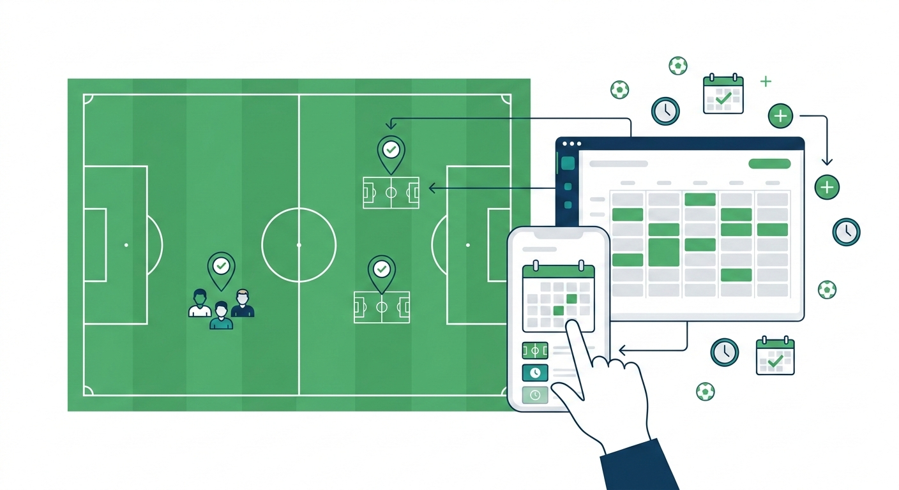

---

## 2. Méthodologie : Design Thinking

  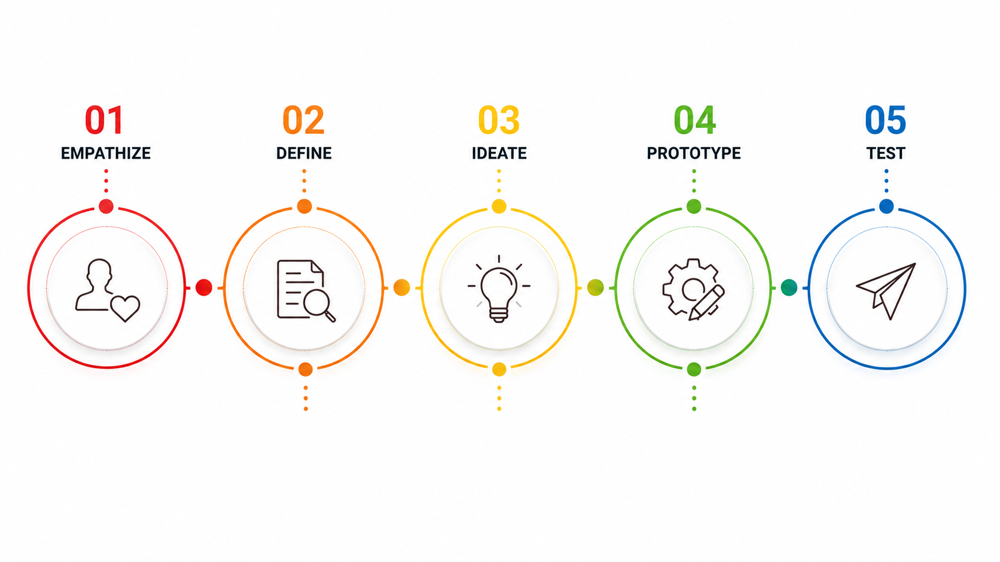

---

## Méthodologie : Scrum (Agile)

  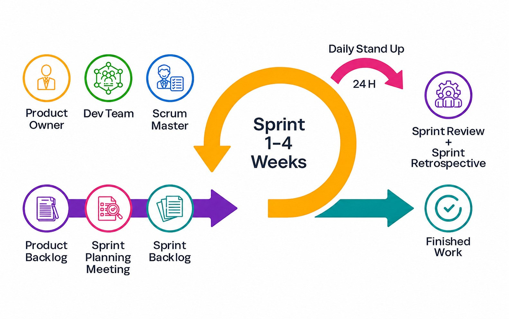

---

## 3. Branche Fonctionnelle

### Cadrage de problème

  

    <h3 style="color: #ef4444; margin-bottom: 15px;">Problématique</h3>
    <blockquote style="font-style: italic; background: #f8fafc; padding: 20px; border-radius: 12px; border-left: 5px solid #ef4444; font-size: 0.9em; line-height: 1.6; margin: 0;">
      "Comment digitaliser la gestion des terrains pour éliminer les pertes de réservations, les conflits de créneaux et la dépendance au téléphone ?"
    </blockquote>
    

      🎯 <strong>Focus :</strong> L'automatisation, la vérification d'identité (CNI) et le contrôle en temps réel.
    

  

---

##  Branche Fonctionnelle

### Global use case :  

  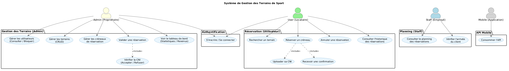

--- 

##  Branche Fonctionnelle

### Global use case :Espace Admin

  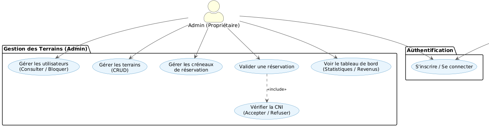

---
##  Branche Fonctionnelle

### Global use case :Espace Admin

  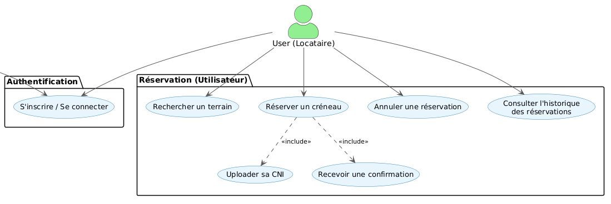

---
##  Branche Fonctionnelle

### Global use case : Mobile

  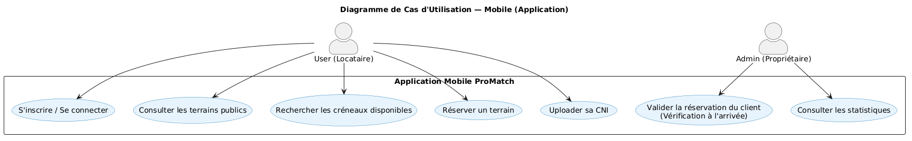

---

## 4. Branche Technique : Tech Stack

  

    <h3>Architecture & Backend</h3>
    <ul style="font-size: 0.8em; line-height: 1.4;">
      <li><strong>MySQL :</strong> Base de données relationnelle.</li>
      <li><strong>Laravel 12 :</strong> Framework PHP Moderne.</li>
      <li><strong>Architecture N-Tiers :</strong> Séparation nette (Model, Service, Controller).</li>
    </ul>
  

  

    <h3>Frontend & Outils</h3>
    <ul style="font-size: 0.8em; line-height: 1.4;">
      <li><strong>Tailwind CSS :</strong> UI Utility-First.</li>
      <li><strong>Alpine.js :</strong> Réactivité légère.</li>
      <li><strong>AJAX / Vite :</strong> Performance et fluidité.</li>
    </ul>
  

---

## 5. Conception : Diagramme de classe

  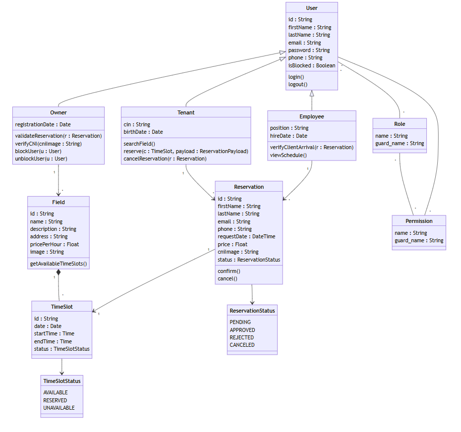

---

## Interfaces Réalisées : Web

  

    <h3 style="font-size: 0.9em; margin-bottom: 10px;">Interface Public</h3>
    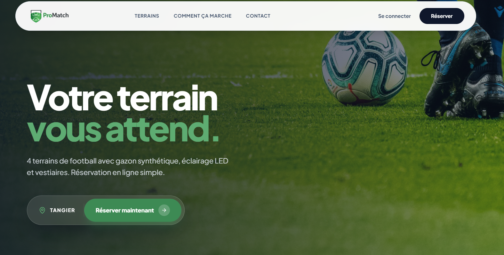
  

  

    <h3 style="font-size: 0.9em; margin-bottom: 10px;">Interface admin</h3>
    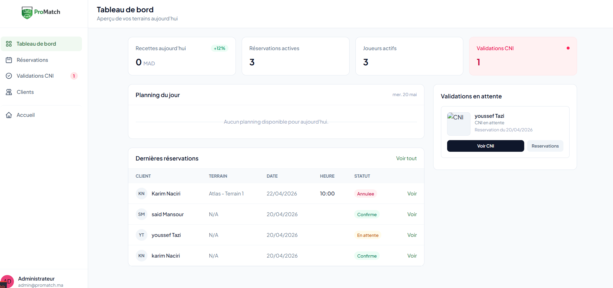
  

  
 
---

  

    <h3 style="font-size: 0.9em; margin-bottom: 10px;">Interface mobile Public</h3>
    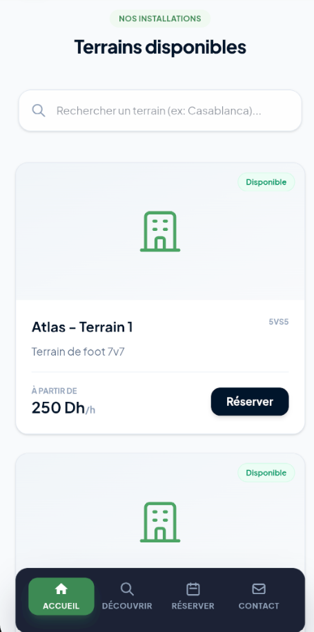
  

  

    <h3 style="font-size: 0.9em; margin-bottom: 10px;">Interface mobile admin</h3>
    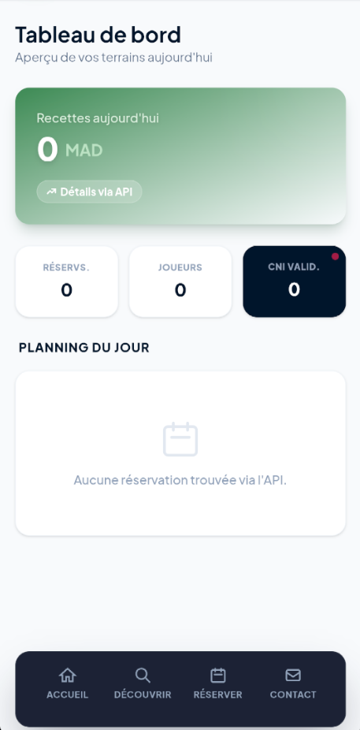
  

  

---

<!-- _class: lead -->

# Merci pour votre attention !
### Des questions ?
